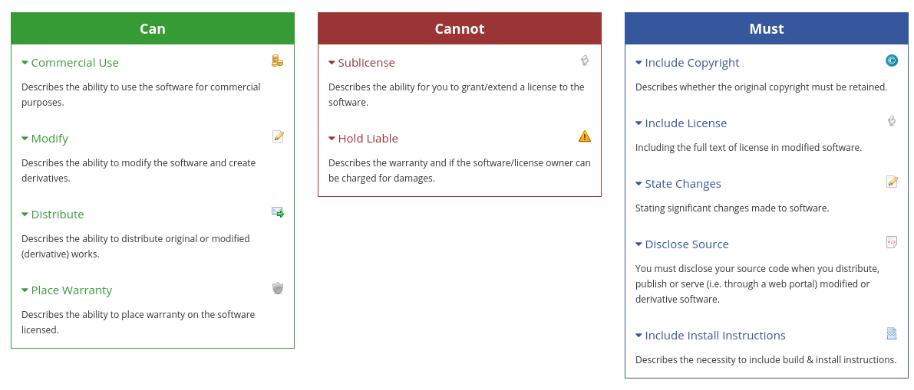

# Jopiter Android

[](LICENSE)
[](https://github.com/JopiterApp/JopiterAndroid/actions/workflows/detekt.yaml)

# Codebase

## Static Code Analysis

[](https://github.com/JopiterApp/JopiterAndroid/actions/workflows/detekt.yaml)

This project uses the Detekt linter to statically analyse all files. It checks that no files contain
smelly code, and helps keeping the codebase clean.

More information on the project can be found on their [official website](https://detekt.dev)

To run detekt, simply execute

```
./gradlew detekt
```

If the build is 💚 green Detekt has found no issues.


# Repository secrets

The signing key is protected using `git secret`. More information about how git secret works can be
found in the [official docs](https://git-secret.io/)

Currently, OpenPGP keys with access:

- Leonardo Colman Lopes
    - Fingerprint `B3A5 9909 9ECC 4DB4 FD40  896F 7706 1922 C587 2792`
    - Original Author
- Github Actions
    - Fingerprint `FD09 E5EC 9AE6 C84D DE2F  585B 2A3A 8839 E62F 07DA`
    - Automatic pipeline for CD
    - Expires 2024-07-09

- [Daniel Cordeiro](http://www.each.usp.br/dc/)
  - Fingerprint `EC89 B406 D3CE 1843 51F7 E462 34D7 619A B850 26D5`
  - Professor in the School of Arts, Sciences and Humanities at University of São Paulo, Brazil
  - Coordinated this project

# Building APK

## Official Build

⚠️ You need the files

- jopiter-key.jks
- keystore.properties

unencripted and available at the root of the project to sign the release

The official Jopiter APP is build using

```
./gradlew bundleOfficial
```

The bundle output will be in `app/build/outputs/bundle/officialRelease`

## Unnoficial Build

An unsigned unnoficial build can be used instead of the original. Keep in mind this will not allow
you to update the app unless you sign with the same key.

```
./gradlew bundleUnofficial
```

The bundle output will be in `app/build/outputs/bundle/unofficialRelease`

# License

[](LICENSE)

See full license in the [LICENSE File](LICENSE)

> The AGPL license differs from the other GNU licenses in that it was built for network software. You can distribute modified versions if you keep track of the changes and the date you made them. As per usual with GNU licenses, you must license derivatives under AGPL. It provides the same restrictions and freedoms as the GPLv3 but with an additional clause which makes it so that source code must be distributed along with web publication. Since web sites and services are never distributed in the traditional sense, the AGPL is the GPL of the web.


